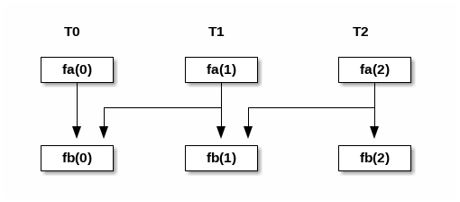

- [TP PDS - Barrière](#tp-pds---barrière)
  - [Instructions](#orgaeae27c)
  - [Exercice 1 : barrière classique](#exercice-1-barrière-classique)
  - [Exercice 2 : barrière inversée](#exercice-2-barrière-inversée)
  - [Exercice 3 : boîte à messages multiples](#org4097036)
    - [Question 1](#org140a44f)
    - [Question 2](#orgcc30c6b)


<a id="tp-pds---barrière"></a>

# TP PDS - Barrière


<a id="orgaeae27c"></a>

## Instructions

Les code pour les 3 exercices est dans le repertoire correspondant (`ex1`, `ex2`, `ex3`). Pour compiler, il suffit d'aller dans le repertoire de l'exercice et saisir la commande `make`. Si vous voulez compiler tout les exercices, saisir `make` dans la racine du projet.

Pour compiler et exécuter les tests, il suffit de saisir `make test` dans la racine du projet. Si vour voler lancer les tests pour un seul exercice, vous pouver saisir le nom du test correspondant :

    test_cases/test_ex1 

pour lancer les tests pour l'exercice 1, etc.

Les tests se basent sur ce que vous avez implementé dans les fichiers `answers.h` et `answers.c` de chaque exercice. Les autres fichiers ne doivent pas être modifiés.


<a id="exercice-1-barrière-classique"></a>

## Exercice 1 : barrière classique

Implémenter la structure barrière vue en TD. Dans le fichier `ex1/barr.c` vous avez un squelette de code à utiliser, le reponses vont dans le fichier `ex1/answers.c`.


<a id="exercice-2-barrière-inversée"></a>

## Exercice 2 : barrière inversée

Un système consiste de 3 threads, T1, T2, T3. Le code est montré dans le fichier `ex2/barr.c` et dans le fichier `ex2/answers.c`.

Il faut coder les fonctions `init()` et `synch(int i)` de manière que `B(0)` arrive toujours après `A(1)`, et `B(1)` toujours après `A(2)`. Tous les autres appels de fonctions peuvent être exécutés dans un ordre arbitraire.




<a id="org4097036"></a>

## Exercice 3 : boîte à messages multiples

Un programme multi-thread contient 1 thread producteur et `N` threads consommateurs. Le producteur produit une donnée (un entier) et la dépose dans la boîte à messages partagée. Chaque consommateur reçoit **la même donnée** avant de faire ses calculs.

Voici le code des threads :

```c
struct mailbox {
    // TODO
}; 

void mbox_init(struct mailbox *mbox, int n);
void mbox_put(struct mailbox *mbox, int d);
int  mbox_get(struct mailbox *mbox, int index);
void mbox_destroy(struct mailbox *mbox);

void *producteur(void *arg)
{
    for (int i=0; i<5; i++) {
        Prod(i);
        mbox_put(&mbox, i);
    }
    return NULL;
}

void *consommateur(void *arg)
{
    int index = *((int *)arg);

    for (int i=0; i<5; i++) {
        int d = mbox_get(&mbox, index);
        Cons(index, d);
    }
    return NULL;
}
```

La fonction `mbox_init(struct mailbox *mbox, int n)` initialise la boîte à messages `mbox` et prend en paramètre le nombre `n` de consommateurs.

Le producteur exécute le code de la fonction `producteur()`, et les `N` consommateurs exécutent le code de la fonction `consommateur()` avec paramètres `0`, `1`, &#x2026;, `N-1` respectivement. La variable `index` indique l'identifiant du consommateur (entre `0` et `N-1`).

La boîte à message contient une seule place ; il n'est donc pas possible pour le producteur d'y mettre une deuxième donnée avant que les `N` consommateurs aient lu la précédente.

Le code se trouve dans le fichier `ex3/prodcons.c`, les reponses vont dans les fichiers `ex3/answers.h` et `ex3/answers.c`.


<a id="org140a44f"></a>

### Question 1

Supposez qu'il y a un seul consommateur (`N=1`). Coder

-   le contenu de la structure `struct mailbox` ;
-   la fonction `mbox_init()` ;
-   la fonction `mbox_put()` et la fonction `mbox_get()`. de manière que :
-   Le consommateur exécute `Cond(0,i)` pour tous `i` en sequence ;
-   `Prod(i)` soit toujours exécuté avant `Cond(0, i)` pour tous `i=0,1,2,3,4`.

****Rappel**** : la boîte à messages (mailbox) contient une seule place !

Un exemple de possible affichage correct pour le programme est le suivant :

    Prod(0)
    Cons(0,0)
    Prod(1)
    Prod(2)
    Cons(0,1)
    Cons(0,2)
    Prod(3)
    ...

etc.


<a id="orgcc30c6b"></a>

### Question 2

Généralisez le code précédent pour gérer un nombre `N>0` quelconque de threads consommateurs.

Pour `N=3`, un exemple de possible affichage correct pour le programme est le suivant :

    Prod(0)
    Cons(0,0)
    Cons(2,0)
    Cons(1,0)
    Prod(1)
    Prod(2)
    Cons(0,1)
    Cons(1,1)
    Cons(2,1)
    Cons(2,2)
    Cons(1,2)
    Cons(0,2)
    Prod(3)
    ...

etc.